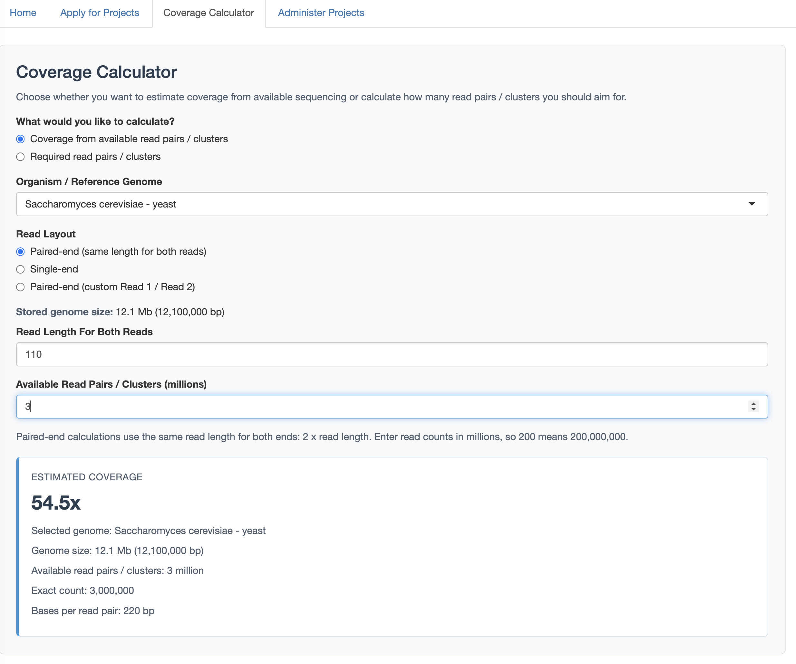
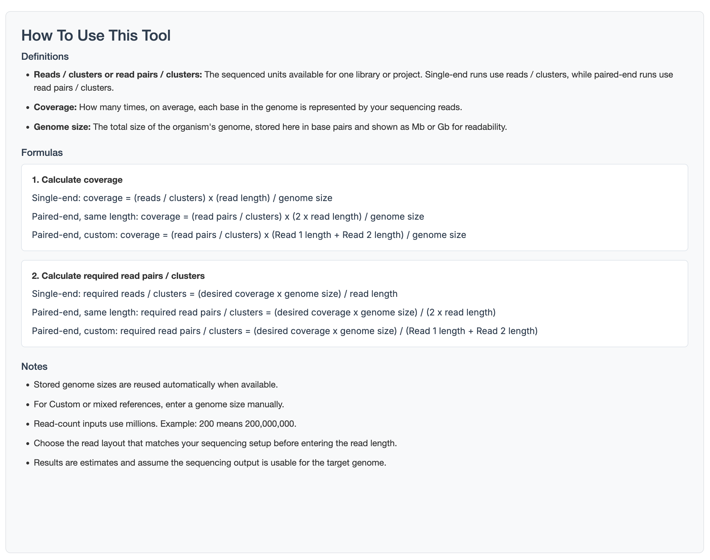

## Coverage Calculator

For easier project planning and calculation, I have now added a **Coverage Calculator** tab for the users.
The tool can help wit hthe estimation from two approaches:

- the coverage they can expect from a known number of read pairs (we don't do a lot of single-end reads)
- the number of reads or read pairs they need to reach a desired coverage


To the right hand side of the calculator I have added some definitions, formulas, and usage notes for the user to help orienting how to use the tool.

## How to use the tool

The user can answer two questions with the tool:

1. **Coverage from available reads**
   - If the user enters the number of reads (e.g. clusters)=> the app estimates the resulting coverage
2. **Required reads for target coverage**
   - If the user enters the desired coverage => The tool can estimate the required read count to reach it.

Both questions depends on the genome size, which is why the first parameter of importance for the user to choose is the genome in question.

::: {#fig-coverage layout-ncol=2 }

{#fig-ui}

{#fig-explain}

The UI of the tool is split into two parts for easier utilization.
:::


## Reference genomes and genome sizes

The calculator uses the existing `reference_genomes` table.

Known genomes currently seeded:

- `Caenorhabditis elegans` -> `100.3 Mb`
- `Danio rerio - Zebrafish` -> `1.4 Gb`
- `Drosophila melanogaster` -> `143.7 Mb`
- `Drosophila pseudoobscura` -> `163.3 Mb`
- `Escherichia coli` -> `4.6 Mb`
- `Gallus gallus` -> `1.1 Gb`
- `Homo sapiens` -> `3.1 Gb`
- `Mus musculus` -> `2.7 Gb`
- `Saccharomyces cerevisiae - yeast` -> `12.1 Mb`

Legacy short names were also normalized at startup so older local databases short names are rewritten to the current full names and keep the correct genome size.

If the user needs to calculate the coverage for an organism, that is not in the list, the genome size can be entered manually given a numeric input with  the units `bp`, `Mb`, or `Gb`.

## Read layout modes

Even though most of our data is in paired-end mode, the calculator supports three read-layout modes.

### Paired-end (same length for both reads)

Use this when both reads have the same length, for example `2x150`.

While the user needs to only input one read-length value, the internal base calculation will be `total bases per pair = 2 x read length`

### Single-end

Use this when only one read is generated per cluster.

While the user input is one read-length value, the internal base calculation will be `total bases per read = read length`


### Paired-end (custom Read 1 / Read 2)

Use this when `Read 1` and `Read 2` differ.

User input:

- `Read 1 length`
- `Read 2 length`

Internal base calculation:

```text
total bases per pair = Read 1 length + Read 2 length
```

## Read-count input units

Read-count inputs are now entered in **millions** (for examples `200` stands for `200,000,000` reads.)

## Formulas used

### Coverage from available reads

$coverage = \frac{clusters\ *\ read\ length}{genome\ size}$

while read-length is always the sum of the two reads if paired-end

### Required reads for target coverage

$required reads = \frac{desired\ coverage\ *\ genome\ size}{read\ length}$

The app rounds required counts up, so the returned target is not underestimated.

## Admin maintenance

Genome sizes can now be managed in the admin UI:

1. Open **Administer Projects**
2. Click **Manage Genomes**
3. Add or edit:
   - genome name
   - optional genome size
   - unit interpretation is stored internally as base pairs

If the size is left empty, the genome remains valid in the dropdown but requires manual size entry in the calculator.
